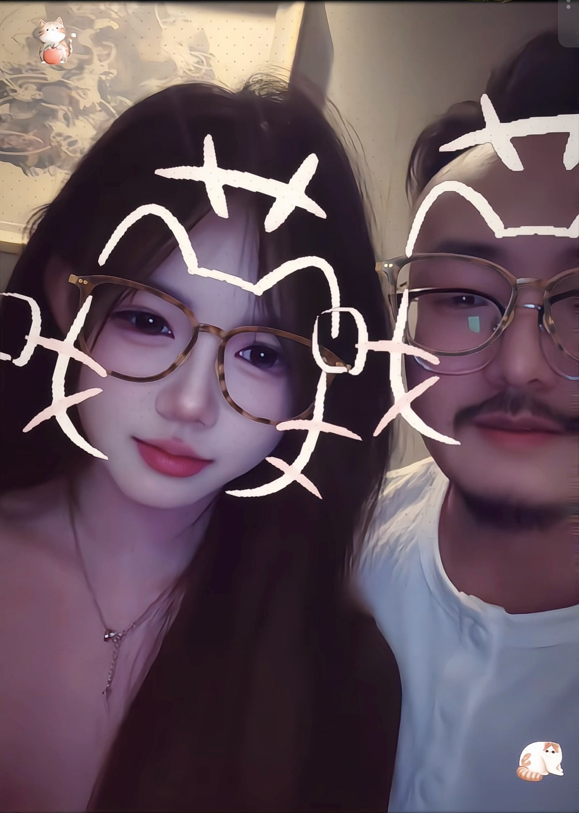
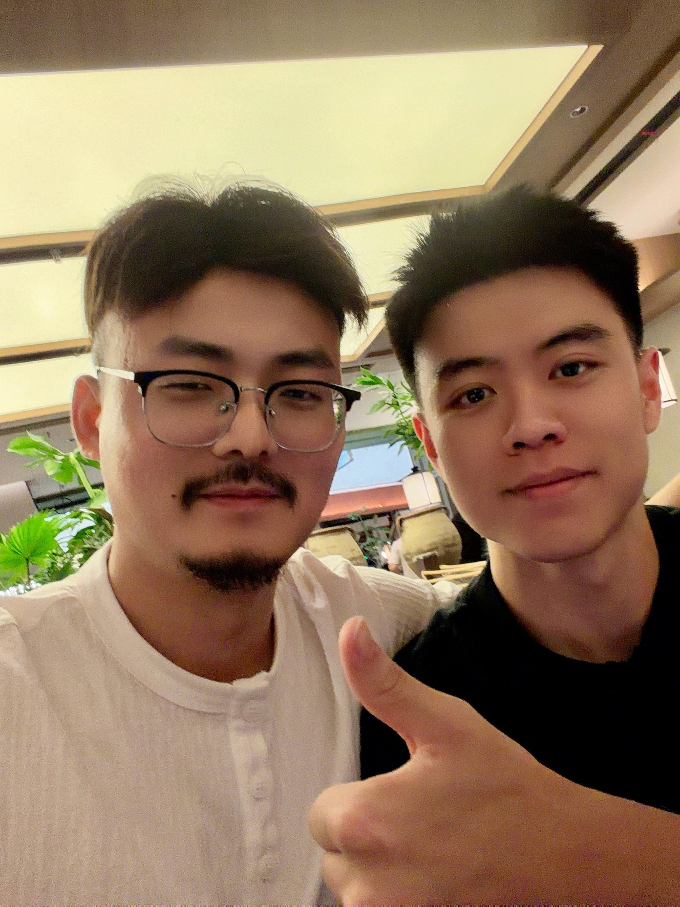

# 人生进阶指南

中文 | [English](docs/en/README.md)

 

这是一份写给普通人的长期成长手册。它从 2017 年的《离谱的英语学习指南》出发，逐渐扩展到 AI 学习、工作能力、人生复盘、创业与恢复。目标不是提供更多值得收藏的工具，而是帮助你完成一个可检查的循环：**诊断现状 → 选择任务 → 主动练习 → 获得反馈 → 留下证据 → 调整下一步**。

这里不会承诺捷径，也不会把个人经验包装成普遍规律。文章会尽量区分三类信息：

- **研究结论**：给出来源，并说明适用边界；
- **个人经验**：保留真实故事，但不声称人人适用；
- **待验证假设**：把它当作下一轮行动要检验的问题。

  <a class="guide-path" href="./docs/threads/part-1/0-cefr.md"><strong>英语学习系统</strong>从 CEFR 自测到词汇、听说读写和 12 周训练。</a>
  <a class="guide-path" href="./docs/threads/part-3/1-ai-learning.md"><strong>AI 学习与工作能力</strong>按任务选择工具，用状态文件延续跨会话学习。</a>
  <a class="guide-path" href="./docs/threads/part-2/my-story.md"><strong>人生复盘、创业与恢复</strong>从真实经历中提炼判断，不复制他人的人生。</a>
  <a class="guide-path" href="./docs/projects.md"><strong>作者项目与现实实践</strong>集中说明作者关联、用途、更新日期与非赞助关系。</a>

## 最新动态

  <figure class="latest-update">
    
    <figcaption><strong>新的开始</strong>离婚后恢复单身，正在寻找新的恋情。</figcaption>
  </figure>
  <figure class="latest-update">
    
    <figcaption><strong>Agentic DB 大会</strong>参加阿里巴巴 x NVIDIA Agentic DB 大会，和粉丝会面。</figcaption>
  </figure>

## 今天就开始

1. 用 [英语能力诊断](docs/templates/english-diagnostic.md) 或自己的真实任务确定起点。
2. 把目标、证据和下一步写进 [学习状态](docs/templates/learning-state.md)。
3. 只选一个 25–45 分钟任务，完成可检查的输出，而不是继续收集资料。
4. 一周后用 [每周复盘](docs/templates/weekly-review.md) 看证据，再调整难度与频率。

## 英语学习系统

先读 [CEFR 目标与自测](docs/threads/part-1/0-cefr.md)，用“我能完成什么任务”而不是模糊的词汇量或考试印象判断水平。

| 环节 | 章节 | 本轮应留下的证据 |
| --- | --- | --- |
| 校准 | [认知篇](docs/threads/part-1/1-understanding.md) | 一个具体场景、基线样本和 12 周目标 |
| 词汇 | [词汇篇](docs/threads/part-1/2-vocabulary.md) | 20 个能听懂、读懂并在句子中使用的词块 |
| 听力 | [听力篇](docs/threads/part-1/3-listening.md) | 一段听写、复述和错误分类 |
| 阅读 | [阅读篇](docs/threads/part-1/4-reading.md) | 一页批注、五句摘要和一个迁移问题 |
| 口语 | [口语篇](docs/threads/part-1/5-speaking.md) | 录音、转写和第二版重录 |
| 写作 | [写作篇](docs/threads/part-1/6-writing.md) | 初稿、反馈清单和修订稿 |
| AI | [用 AI 学英语](docs/threads/part-1/7-ai.md) | 可复用提示词、错题记录和学习状态更新 |

词表只是查阅材料，不是学习目标。需要时可进入 [通用词表](docs/threads/word-list/Common.md) 与各技术主题词表。

## AI 学习与工作能力

[使用 AI 学习一切](docs/threads/part-3/1-ai-learning.md)采用按任务选择的工作流：

- 需要循序提问、知识检查时，使用带引导学习能力的对话；
- 需要长期材料、作品、错误和上下文时，使用项目空间并维护本地状态文件；
- 需要有来源的研究时，优先选择能回到原始材料的检索或资料库；
- 需要最终交付时，由人定义标准、检查事实并承担判断责任。

产品功能变化很快。涉及 ChatGPT、Gemini、Claude、NotebookLM、Perplexity、DeepL 等产品的说明都会标注核验日期、地区/套餐限制和官方来源。工具排名不会成为方法的中心。

## 人生复盘、创业与恢复

个人故事被保留，是因为成长从来不只发生在学习计划里。你可以阅读 [我的故事](docs/threads/part-2/my-story.md)、[创业篇](docs/threads/part-2/entrepreneurship.md) 和 [旧文归档](docs/threads/archive/README.md)。这些内容是作者的经历，不是医疗、法律、投资或创业建议。

公开版本遵循最少必要原则：不再展示个人 QQ、二维码和不必要的第三方身份信息；涉及家人、儿童、前伴侣或其他第三方的照片，应在明确授权后才公开。发现隐私问题请按 [安全政策](https://github.com/byoungd/up/blob/master/SECURITY.md) 私下报告。

## 作者项目与透明说明

作者参与的产品、公司参访与现实项目统一放在 [作者项目与现实实践](docs/projects.md)。页面会明确作者关联、用途、更新时间和“非赞助”声明。正文不因商业关系改变推荐标准，站点默认不接入广告、分析脚本或追踪器。

## 如何判断自己在进步

不要只统计学习时长。每周至少观察四类证据：

- **完成**：是否完成计划中的真实任务；
- **质量**：正确率、可理解度、结构、流利度或反馈等级是否改善；
- **保持**：隔几天后能否主动回忆并再次使用；
- **迁移**：能否把所学用到新材料、新对话或真实工作中。

当表现稳定提高时增加间隔或难度；当错误持续重复时缩小任务、补足先修知识并增加反馈。计划服务于表现，而不是让表现服从日历。

## 项目边界

- 本项目是“开放内容项目”，不是 OSI 意义上的开源软件：正文与作者内容采用 **CC BY-NC 4.0**，站点配置、检查脚本和构建代码采用 **MIT**。详见 [许可证说明](https://github.com/byoungd/up/blob/master/LICENSE.md)。
- 引用、图片和第三方素材的来源及授权状态记录在 [第三方素材与引用](https://github.com/byoungd/up/blob/master/ATTRIBUTIONS.md)。
- 贡献前请阅读 [贡献指南](https://github.com/byoungd/up/blob/master/CONTRIBUTING.md) 和 [行为准则](https://github.com/byoungd/up/blob/master/CODE_OF_CONDUCT.md)。
- 页面中的产品信息核验于 **2026-08-16**；过期内容欢迎提交 issue。

## 在线阅读

- [GitHub Pages](https://byoungd.github.io/up/)
- [GitHub 仓库](https://github.com/byoungd/up)
- [知乎旧版文章](https://zhuanlan.zhihu.com/p/444211376)

如果今天只做一件事：创建一份 [学习状态](docs/templates/learning-state.md)，写下当前证据和下一步，然后完成其中最小的一项。
