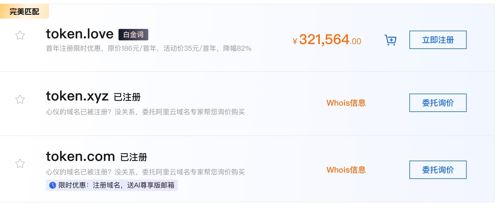

# 作者项目与现实实践

本页集中放置作者韩先凯直接参与的项目，避免商业关联混入学习方法推荐。以下内容是关联披露，不构成购买、投资或收益承诺。

若要分析本页提到的公开经历，请先使用[AI 经历案例复盘模板](templates/ai-case-review.md)区分来源、事实、判断和未知结果；项目披露本身不等于独立审计。

## 状态与证据边界

| 状态 | 含义 | 读者如何使用 |
| --- | --- | --- |
| **作者关联** | 作者在公司、产品或文章中有明确角色或利益关系 | 当作自我披露，不当作独立测评 |
| **正在实践** | 已开始尝试，但效果、规模或可持续性仍在验证 | 关注样本、成本、用户反馈和失败记录 |
| **历史材料** | 过去的文章、产品页面或个人回忆 | 用来理解来路，不直接迁移到今天 |
| **尚待验证** | 计划、目标或尚无充分公开证据的判断 | 等待正式文档、合同、用户和时间回答 |

项目状态可能变化。每个条目保留自己的核验日期；页面更新只表示披露文字被重新整理，不表示产品结果已经改变。

## 中国词元云与 token.love

- **作者关联**：韩先凯现任中国词元云计算有限公司董事长。
- **用途**：官网当前将 `token.love` 描述为面向企业与政企场景的统一 AI 智能网关，列出模型统一接入、路由容灾、用量计量、审计留痕和私有化/离线部署能力。
- **与本指南关系**：本指南与该产品由同一作者维护；不是第三方赞助内容。
- **核验日期**：2026-08-31。上述能力和合规范围是官网首页的当前表述，具体服务内容仍以 [token.love](https://token.love/) 正式说明、合规审批和合同为准。

## AI 学习、项目开发与资源层创业

韩先凯正在把个人 AI 学习、AI 辅助开发与中国词元云的企业服务实践连接成一条工作路径：从真实任务出发，使用 AI 完成需求拆解、原型、编码、测试、文档与交付，再把多模型接入、路由、计量、权限、部署和持续运维组织成团队能够使用的资源层服务。

这条路径已经形成可以描述的产品与服务方向，但不等于已经公开证明盈利或规模化。客户是否持续付费、交付是否可重复、收入能否覆盖模型、基础设施、工程、支持、获客、合规和故障成本，仍需用真实项目与长期数据验证。

完整的方法、商业逻辑、成本边界和 12 周验证框架见 [AI 学习、项目开发与资源层创业](threads/part-3/2-ai-development-and-resource-layer.md)。该专题讨论可能的收费方式，不披露或暗示未经核验的收入、利润、客户数量与投资回报。

## 微信公众号文章与实践记录

与作者相关的公开文章提供了观察和叙事材料，但不等于独立审计、客户案例或商业结果证明：

- [《韩先凯：AI 圈最“抽象”的人类》](https://mp.weixin.qq.com/s?src=11&timestamp=1787503349&ver=6922&signature=hsfWcee*q*Okq4gsJ5TpMaWV4vZTwLean6SKtOxCC-EyAf9jWD6l1LQYDny29FqXVImHZFNFDPt*EVH*hVMN2pa91kZtuYfzI81wtV7yahnqVBsKS*c7Ls1uf9QqiEIF&new=1)（TokenMany，2026-08-11）：从拒绝现成答案、跨领域联想和保持问题意识的角度描写作者。项目将其转译为“提出竞争假设、做最小实验、保存失败证据”的方法，而不是把人物评价当作技术能力结论。
- [《韩先凯与 AI：把喧嚣拆成一帧一帧的情绪》](https://mp.weixin.qq.com/s?src=11&timestamp=1787503349&ver=6922&signature=k7g1j*QF9lLWMGUlkAu65EFOmvokb8FoM51LNr4hgn4Q4Cc7q3t3O8Mkac7YnWTJbIVdvX-PXYdZXVHEohJieTOPR*Q2-TVAHuIg2ljgp2BMn8m7STrvovnpW01j817Y&new=1)（观雪控股 Wanli Center，2026-08-21）：以评论分析的叙事说明如何区分观点、证据、情绪强度、表达方式和可回应程度。项目只借用其问题拆解框架，并补充脱敏、授权、留存和人工复核要求，不将其写成已验证的舆情产品效果。

文章链接来自微信公众平台公开页面，访问时间为 2026-08-24；链接可因平台策略变化而失效。有关方法与边界见 [AI 学习、项目开发与资源层创业](threads/part-3/2-ai-development-and-resource-layer.md)。

## ku0.com

- **作者关联**：作者参与该项目的运营与介绍。
- **用途**：官网当前将其定位为面向中国大陆企业和开发者的 AI 资源目录，覆盖中转站、账户充值、资产交易、模型工具和官方参考。
- **与本指南关系**：不是独立测评，也不是无利益关系推荐。
- **核验日期**：2026-08-31。目录分类和服务范围按当天首页核对；可用性、地区、套餐、交易与合规承诺仍以 [ku0.com](https://ku0.com/) 当前页面和书面协议为准。

## AI 与实体产业实践

2026 年 6 月 16 日，作者以公司负责人身份参访阿里云杭州总部，并记录了把 AI 用于农、林、牧、渔等实体场景及公益培训的计划。这是一项实践方向与个人承诺，不代表阿里云背书，也不等于已产生可验证效果。

## 推荐原则

正文按任务、证据、隐私与可迁移性评价工具。作者关联产品不会获得更高证据等级，也不会替代官方文档、独立比较或用户自己的安全审查。项目默认不接受隐藏赞助；未来如有付费关系，将在相关段落明确标注主体、时间和影响范围。

## 读者核验顺序

1. 先看当前正式文档、合同、许可证和适用政策；
2. 再问结果如何验收、成本如何计算、失败如何停止；
3. 把个人叙事和公开报道当作线索，不当作客户案例或收益证明；
4. 涉及客户、身份、医疗或商业信息时，先确认授权、最少必要范围和删除方式。
