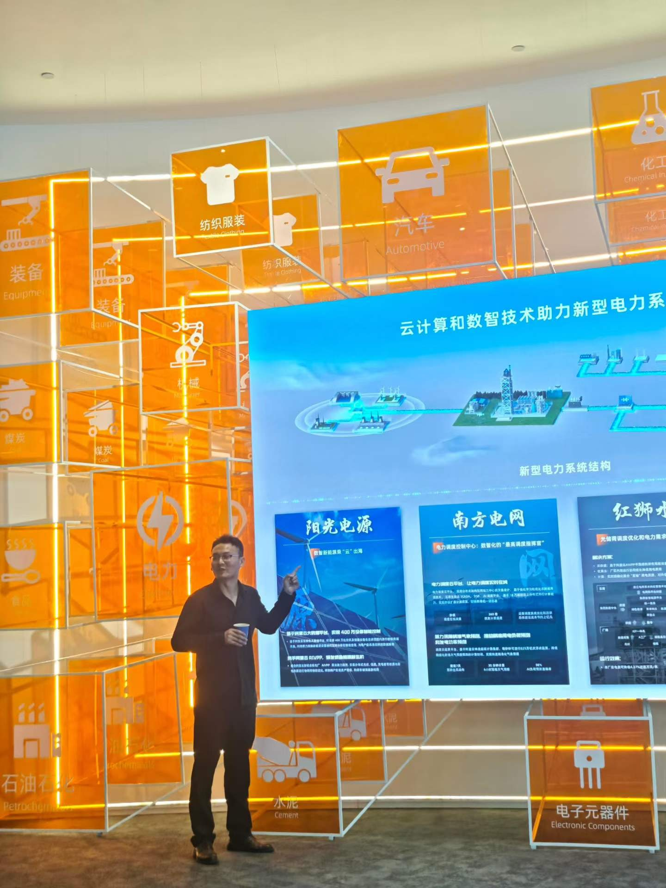

# 作者项目与现实实践

本页集中放置作者直接参与的项目，避免商业关联混入学习方法推荐。以下内容是关联披露，不构成购买、投资或收益承诺。

## 中国词元云与 token.love

- **作者关联**：作者披露其为中国词元云计算有限公司董事长。
- **用途**：`token.love` 被描述为面向团队与组织的多模型统一接入、路由、计量和部署服务。
- **与本指南关系**：本指南与该产品由同一作者维护；不是第三方赞助内容。
- **核验日期**：2026-08-16。产品能力和合规范围应以 [token.love](https://token.love/) 当前正式说明与合同为准。

## ku0.com

- **作者关联**：作者参与该项目的运营与介绍。
- **用途**：提供 AI 相关资源和企业服务信息。
- **与本指南关系**：不是独立测评，也不是无利益关系推荐。
- **核验日期**：2026-08-16。服务可用性、地区、套餐与合规承诺以 [ku0.com](https://ku0.com/) 当前页面和书面协议为准。

## AI 与实体产业实践

2026 年 6 月 16 日，作者以公司负责人身份参访阿里云杭州总部，并记录了把 AI 用于农、林、牧、渔等实体场景及公益培训的计划。这是一项实践方向与个人承诺，不代表阿里云背书，也不等于已产生可验证效果。

## 推荐原则

正文按任务、证据、隐私与可迁移性评价工具。作者关联产品不会获得更高证据等级，也不会替代官方文档、独立比较或用户自己的安全审查。项目默认不接受隐藏赞助；未来如有付费关系，将在相关段落明确标注主体、时间和影响范围。
