# 我的故事：失败、恢复与重新出发

> 内容提示：本文包含创业失败、长期失眠、严重压力和曾经出现过的轻生念头。它是个人回忆，不构成医疗、心理、法律或财务建议。若你正处于紧迫危险，请联系身边可信任的人和当地专业支持；如果阅读让你不适，可以先停下来，找一个可信的人陪你。

## 叙事边界

这是一份从我个人位置写下的回忆，不是所有当事人的共同版本。文中的伴侣、合伙人和朋友使用化名或概括性称呼；孩子和其他第三方只保留理解事件所必需的细节。日期、金额和身体经历来自我的记忆与记录，仍可能存在误差；情绪判断不等于对他人的事实判决。涉及他人的照片和故事只在获得必要同意、尊重删除请求的前提下保留。

如果你想把这段回忆当作一次学习材料，可以先读[叙事与证据篇：不把经历写成命运](narrative-and-evidence.md)，再回来看哪些是事实、哪些是我的解释，以及哪些结论仍然需要保留。

## 一家公司倒闭之后，我如何面对那些代价

朋友们，你们好，我是离谱。今天想把一段并不体面的互联网创业经历，尽量诚实地讲完。

2017 年 4 月 1 日，我以普通前端开发的身份入职了南京 xx 科技有限公司，开始研发一款为律师/律所服务的软件。当时该软件的第一版是找外包公司做的，代码没有注释，没有项目管理，一塌糊涂。更糟糕的是，当时公司没有产品经理，所有的 idea 都靠老板拍脑袋。

入职一个月，我负责的时间轴模块改了 20 多版，如此高频率的修改需求，真的把自己整麻了。

好在一个月之后，第一个版本提测，效果基本符合老板的预期。之后我主导前端项目以 Vue 作为技术栈进行重构。经过半年多的努力，终于发版了。这个时候开始销售了，我们原本以为至少在行业里会有一点声响，然而结果却令人大失所望，很长一段时间都完全没有开单。

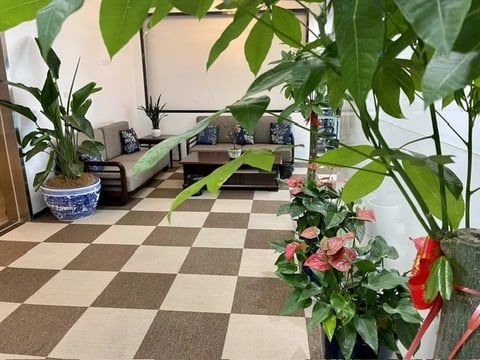

由于公司发展不顺，大家的待遇没有随着工龄增长，很多同事带着失望陆续离开。看着昔日有说有笑的人一一离开，心里很不是滋味。我从一开始就看好这个产品，即便成员换了一轮又一轮，前几年我的待遇也没有增加，我还是选择留下。

就这样，我成了公司唯二一直留下来的人。我也从普通员工做到部门 leader，再到公司总经理，并一步步走向合伙人的角色。离谱的故事就此拉开序幕。

后来回看那段日子，我发现所谓“专心做事业”从来不是一个人的故事，爱情和家庭也一直在场。

### 爱情

感谢上天对鄙人的眷顾，让我在合适的年纪遇到了我喜欢的人。她叫若涵（化名）。我在 [离谱的英语学习指南](https://github.com/byoungd/up) 里用顾城的话描述过初见她时的感觉：草在结它的种子，风在摇它的叶子。我们站着，不说话，就十分美好。

2017 年 8 月 19 日，我陪她一起去上海完成一件意义非比寻常的事。那天我们在上海外滩拍了很多照片，那些照片，每次看到我都会忍不住流泪。所以时至今日，在手机里看到这部分的照片我都会刻意地快速滑走。我没有勇气再次去回忆那种痛苦。

那晚，夜色正美，可是空气中弥漫着一种令人喘不过气来的压抑。看着外滩一排排的银行大楼，惬意地吹着晚风，我们都努力不让对方觉得自己情绪低落，因为我们都知道，有一件事正在发生，且我们无能为力。

那天，在我滔滔不绝描述美好未来时，她忽然哭了，哭得没有声音。我过了好一会儿才发现。她似乎已经明白，我口中的未来未必真的有她的位置。她转过身去，背对着我。那一刻，我第一次看见她的脆弱。

也就是在那一瞬间，我发现自己真的爱上了她，也第一次明白，爱不是替另一个人设计幸福，而是愿意和她一起面对生活的不确定。

#### 如果爱有回声

后来我常常想，爱情最虐人的地方，并不是两个人没有相爱过，而是明明相爱，却总有一些时刻，让你清楚地看见自己的无能为力。

我曾经以为，爱一个人就是带她去更远的地方，看更大的世界，吃更好的饭，过更体面的生活。可后来我才明白，爱有时候只是深夜里的一句“没事”，是她明明也很难过，却还要先把你的情绪接住；是你看见她偷偷咽下委屈，却连一句像样的安慰都说不出口。

这张照片里的她，眼睛里还有很亮的光。那时候的我们，都还不知道未来会有多少风浪，不知道生活会把一个人逼到什么程度，也不知道有一天，连出去吃一顿饭、买一个蛋糕、说一句“以后会好的”，都会变得小心翼翼。

我最难过的，从来不是自己吃过多少苦，而是我的决定让她也承担了不确定。我曾经替她想象“更轻盈的日子”，后来才知道，那仍然是我的想象；我能负责的，是承认自己造成的影响，不替她解释感受。

如果有一天，她问我这一切值不值得，我大概会沉默很久。因为那些狼狈、亏欠和遗憾，确实不值得。可如果问我遇见她值不值得，我一定会说，值得。

因为她让我知道，真正的爱情不是只在顺风顺水时说漂亮话。世界坍塌时，我不能替她消除所有阴影，但可以承认我制造的那一部分，并把能承担的责任留在自己手里。

也许爱从来没有什么回声。你喊出的承诺，很多时候只会落进漫长的岁月里。但我仍然愿意相信，那些曾经认真爱过的人，终会在某个平凡的清晨，被生活轻轻归还一点温柔。

我们走进婚姻，也有了孩子。

之后为了拓宽事业，我尝试过温泉度假酒店和会所项目，最后付出了沉重代价，这里暂且不展开。

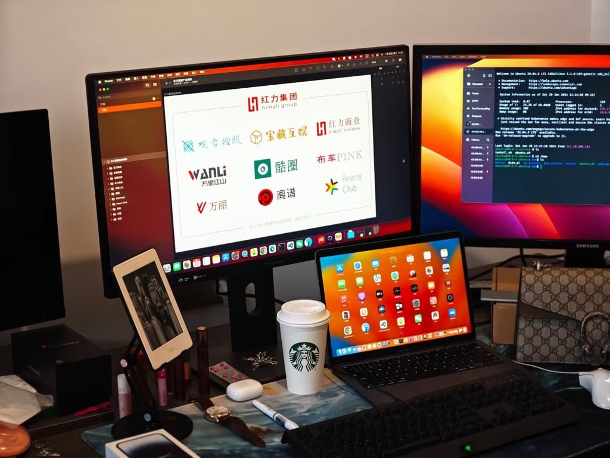

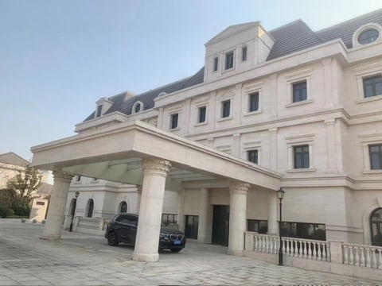

### 餐饮

我的亲戚在南京某地开了一家淮南牛肉汤店，生意相当不错，之后我表哥开了第二家，生意异常火爆。在研究了一下这个品类之后，我自己也开了一家，生意好得远超预期。

接着我自己开始搞设计、搞装修，并适当地拓宽品类，开了第二家、第三家……

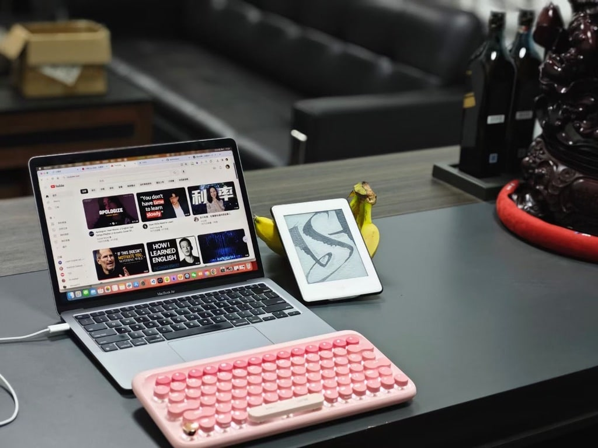

为了在外卖平台能让店铺的产品有更好的展示，我自己摸索着摄影和 PS，亲手制作了一整套产品图。

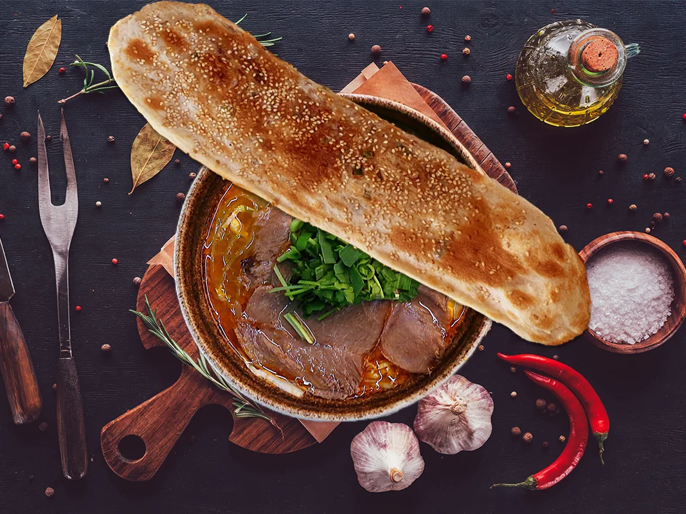

这些小餐饮店，是真的辛苦，但是现金流却很不错。虽然我开的这些店随着“口罩”时期的到来而逐渐关门，但在这之前也让我小赚了一笔，这也为我成为公司合伙人做了资金上的铺垫。在此期间我也买了自己的 Dream Car。

### 经营公司

在公司收支基本持平的时候，我们搬到了更大的办公室。在尚未装修的展台前，我畅想着美好的未来。

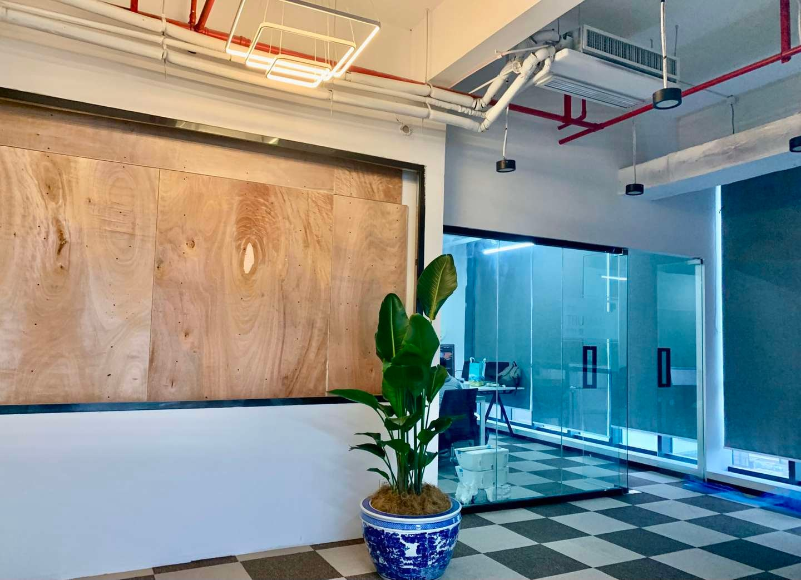

为了打造更好的工作环境，我们招募了更多年轻同事，逐步提高福利待遇，也隔三差五组织聚餐和休闲活动。

上图是我跟前端 Leader Nas 一张珍贵的合影。

可是好景不长。2022 年初，软件销量明显下滑，我们迟迟找不到解决方案。产品功能大而全，缺陷密集，始终没有达到我希望的可靠程度。客户反馈频繁遇到问题，如果价格不是很低，后果可能会更严重。

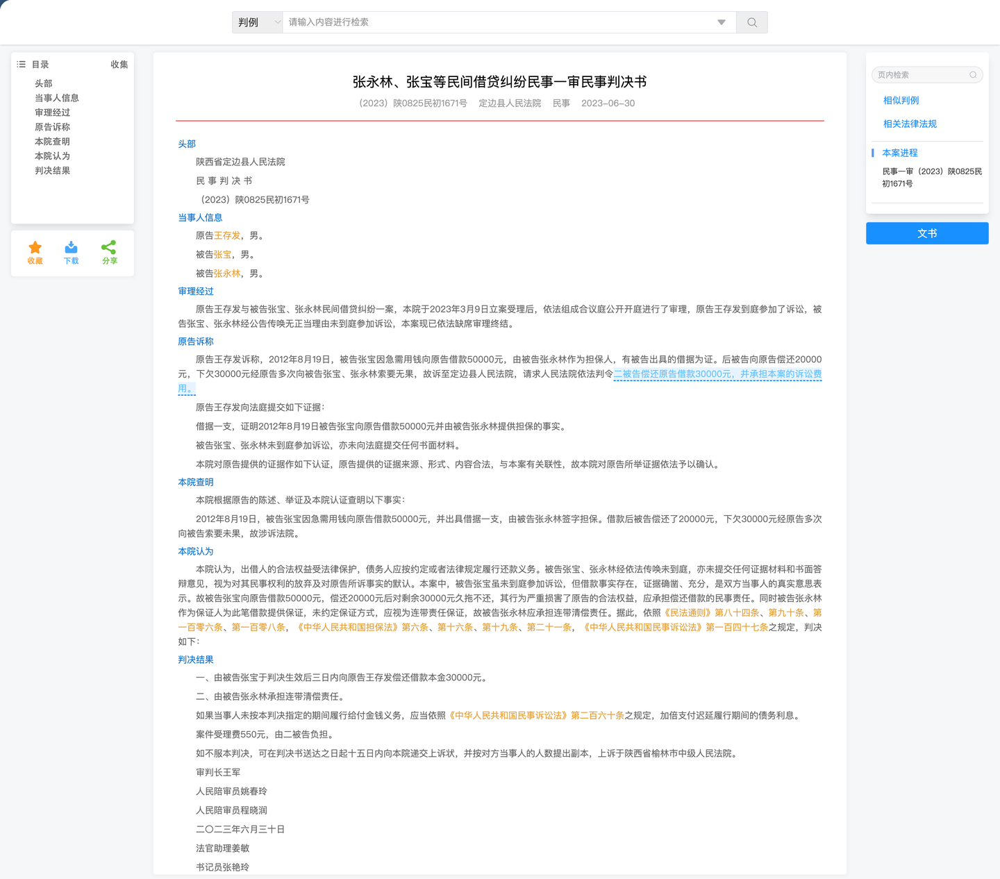

为了解决一些关键节点上的问题，我挖来了当时在字节搞容器安全的高中同桌。他一直是我心目中很特别的一个人。在他加入我们公司后，发现了一些非常关键的问题。

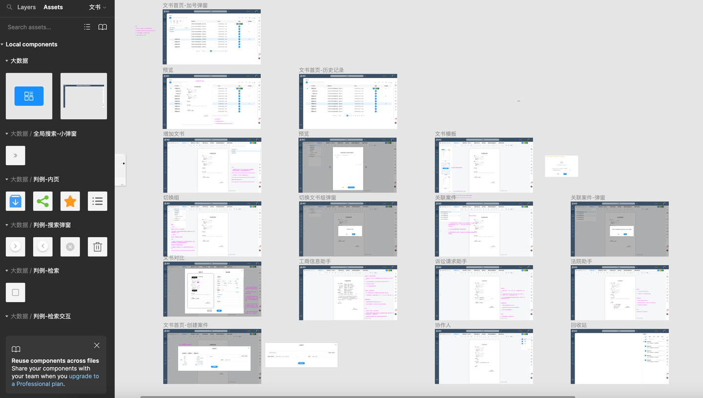

首先是项目结构老旧，很多地方存在性能和安全问题；一些被称作“大数据”和“AI”的功能，并没有建立在可用的数据集和训练流程上，本质上只是 Elasticsearch 搜索和预设结果。我们原以为拥有核心资产，后来才发现，许多东西只是堆叠出来的功能，而绝大部分精力都花在了多端适配和继续增加模块上。

我们不遗余力地在 UI 和很多细节体验方面进行迭代，然而核心的问题却因为缺少数据集，大数据提取的数据完全没有样本，根本无法进行训练。

做了几年“大数据”，却没有把数据基础真正建起来。意识到问题的严重性后，我不禁后背发凉。

到这个阶段，我们进退两难：继续迭代，旧架构会让每次修改都变得昂贵；重构，又需要公司账上难以承受的成本。

那天我和另外两位合伙人在办公室讨论到很晚。公司最大的股东龚总（化名）情绪近乎崩溃，只反复追问一句：“你告诉我，这件事到底还能不能做？”

我很能理解他的心情。他已经为此投了一千多万，全是自己的钱，没有一分是投资人的。我也为此投入了几百万，当时大家的心情是很难用语言去描述的。

之后龚总情绪失控，把他亲手制定的 40 多页《员工管理手册》摔在会议桌上，声音在办公室里回荡。有些事情其实早已难以继续，只是大家仍然舍不得放下幻想。

随着公司入不敷出，工资开始无法按时发放，我们四处找钱、借贷。在极度高压下，管理逐渐转向抓考勤、减福利、要求无意义加班和细密汇报，团队越来越疲惫。我知道解散只是迟早的事。我极力反对这些形式，但龚总的一句话让我无法继续争辩：“我出钱最多，我说了算！”

到了 9 月份，公司的氛围已经糟糕到没人愿意来上班，于是大家集体辞职，宣告了这场游戏的落幕。

公司倒闭，亏损的资金暂且不谈，我为此努力的五六年啊。那些每日每夜赶项目的日子，都能轻而易举地忘了吗？而且，我的同桌因此被我坑了一把，原本他留在字节可能会有个更好的发展吧。我曾幻想过公司成功后大家把酒言欢的场面，然而却事与愿违。

在公司宣布倒闭后，我连向他说声抱歉的勇气都没有。我的内心是何等地难受，没法与人诉说。那些曾经和我一同奋战的小伙伴们，回想起那些难忘的点点滴滴，会想起我们曾经因为攻坚了一些重点难点而欢呼雀跃，甚至激动得彻夜难眠；会想起我的信誓旦旦；会想起我在开会时的豪言壮语……

对此，我真的心存歉疚。

在这里，我想对他们说一句：“I'm so sorry!” 虽然，他们也许永远都看不到这个。

### 身体垮掉

我从 6 月份开始，因为与龚总在管理公司的理念有着严重冲突，且在被粗暴干预公司管理的情况下，我的身体产生了一些反应。胃开始变得不舒服，之后患上了糜烂性胃炎且久治不愈。再之后开始失眠，胃病不断恶化。再之后阳了，整个人似乎得了各种病。视力变得模糊不清，食欲不振加上长期失眠，浑身多处游走性疼痛，整个人快要不行了。

有一天夜里，我突然对若涵说，我可能快不行了，随后开始胡言乱语、交代后事。她哭了起来，也惊醒了孩子。那一晚我们都很害怕，过了很久才慢慢安静下来。

之后的几个月，我辗转于南京的各家医院，各种排队等待，各种拍片子/核磁/验血，整个人就像掉了魂一样。于我而言，我的世界已经蒙上了一层黑雾，看不到边。

检查出来一些小毛病，但是医生都非常确定地告诉我，我没啥事。但我自己的感觉却认为，一定有什么没有检查出来的病症。每天还是在医院里挂号、等待、检查、等结果，再找医生咨询，排除了这个病症再去检查别的。我会在各种网站上查询类似的症状，一边暗自告诉自己没事的，一边又自我怀疑。

长期编程也让我出现了持续的腰背问题。这段经历提醒我：身体不是可以无限透支的资产，反复出现的症状应该交给专业人士评估，也值得在日常工作中提前照顾。

在最慌乱的时候，我尝试过不同的治疗方式，家人甚至带我寻求民间帮助。现在回头看，那更多是无助之下的本能反应，而不是可靠的解决方案。

虽然我深知这样下去不是办法，但是我就是整夜整夜地失眠，毫无精气神。

我们几个人合计亏损超过 2000 万，加上度假酒店和会所项目的损失，压力极大。最艰难的时候，我甚至考虑过出售若涵老家的房子。我没有向亲戚借钱，一方面是难以开口，另一方面也害怕把无法兑现的压力转嫁给关系。借钱之前，至少要诚实评估还款能力、关系成本和退出方案。

我甚至动过把刚开了一年多的车子卖掉的念头，但被家里人劝住了。房子已经卖了，再卖车的话，多少对生活会有影响，毕竟孩子要上学了，而且卖车的话也收不回多少资金。

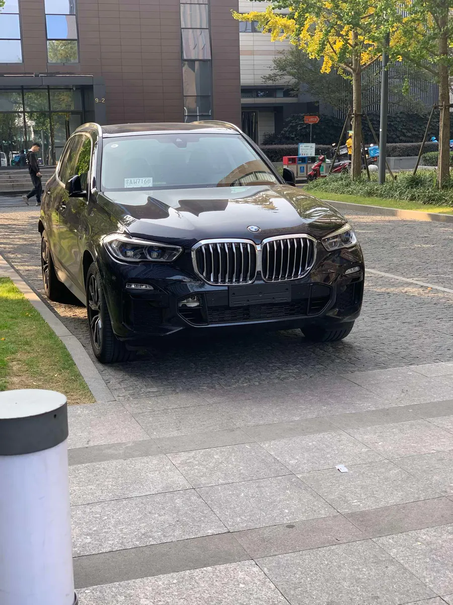

### 回老家之后

2023 年 3 月底，我转让掉了最后一家小餐饮店。6 月底，收拾好东西，回老家了。

带着三岁的儿子离开自己待了十几年的城市，多少有些伤感吧。

由于身体的不适持续恶化，我变得沉默寡言。从不愿出门，到不愿意说话，甚至到了饭都懒得吃的地步。

要不是老妈每天微信喊我吃饭，我估计连饭都不吃了吧。

那时我已经快 30 岁，却还要让母亲每天提醒我吃饭。这让我惭愧，也让我第一次承认，自己确实需要别人帮忙。

我也很讨厌这样的自己，可我感觉就是非常无力、无助，就像身处漩涡的中心，无论怎么挣扎都爬不出来。

长时间不做任何事情也非常无聊。有一天我把台式机重新组装起来，玩起了英雄联盟。我没日没夜地玩，玩到自己都觉得无聊。因为睡不着，我索性任由自己继续下沉。

### 看不到希望的生活

我沉迷于游戏，日夜颠倒，一分钱不赚，与过往小确幸的生活有着巨大的落差。卖房度日、和父母同住，再加上我迟迟没有恢复行动，让生活充满失望。她也承受了很大压力，问我这样的日子还要持续多久。

我向她怒吼道：“你想要我怎么样？”

其实，真的很迷茫，不知道要怎么办。

软件公司倒闭了，我的程序员生涯也随之结束了。我默默地退出了很多群，关掉了 GitHub，屏蔽了一些联系人，一些以前每天必逛的网站也再也没有打开过了。

创业期间，因为资金的事情还跟自己玩得最好的朋友乐乐闹掰了。那么多年的友谊，因为我的执着，兄弟反目，许久不再联系。失去的，有点多。

我不止一次问自己：“当初为什么要拼命坚持下去？”

如果当初做一些其他的选择，结局会不会不一样？在公司发展的一些关键节点上，如果我更努力，会不会好一点？如果早一点或者晚一点做这个事情会不会好一点？如果我能……

仔细想想，做行业软件，真的不是靠着一腔热血和几个看似新奇的 idea 就能成的。每个创业者都曾认为自己了解用户的需求，认为自己的产品解决了行业痛点，认为自己的产品应该会迎来爆发式的增长。成功的条件，往往跟很多你无法把握的条件有关，如天时地利。比如我们当时花了很大精力研发的智能问答机器人，如果在 ChatGPT 出来之后我们搞，完全就是两码事。可是我们并不会恰好等到一个会和我们有关的 ChatGPT。

### 感悟

如果你要问我，公司做倒闭了，是什么体验？

我只能告诉你，年轻的时候摔一跤，也未尝不是好事，这只不过是生活的一个小插曲而已。

那是我嘴硬的说法。真实感受只有一个：很难受。

我清楚地记得儿子生日那天一大早，若涵跟我说，今晚去吃火锅吧。我却犹豫了许久，说了句：“没必要吧，咱们买个小蛋糕在家过就行了。”这样的回答显然出乎她的意料。她沉默下来，努力掩饰低落的情绪。那时我才意识到，出去吃一顿饭已经成了需要反复权衡的奢侈，而这一天本来应该被好好庆祝。我从没想过自己会走到这里。

那天晚上我们还是去吃了海底捞，但是基本没有点菜。当服务员唱生日歌唱到“跟所有的烦恼说拜拜”的时候，我彻底破防了。哪有这么容易的事啊。当家人因为你的决定承受委屈时，自己的辛苦并不会抵消那份愧疚。一件不起眼的小事，也可能击穿你努力维持的坚强，让难过和沮丧一起涌上来。

## 2026-04-22 更新

很多人关心我现在怎么样，我还在，我很好。

补充说明：本文有限的文字主要记录了我与合伙人龚总（化名）在公司后期的冲突，容易让他看起来像一个单一的对立面。那只是我的视角，不是对他的完整判断；他也有许多值得肯定的品质。公开叙事应当给他人留下不被我的版本完全定义的空间。

## 2026-06-16 更新

2026 年 6 月 16 日，我以中国词元云计算有限公司董事长的身份，受杭州阿里巴巴邀请，前往阿里云杭州总部参观考察。

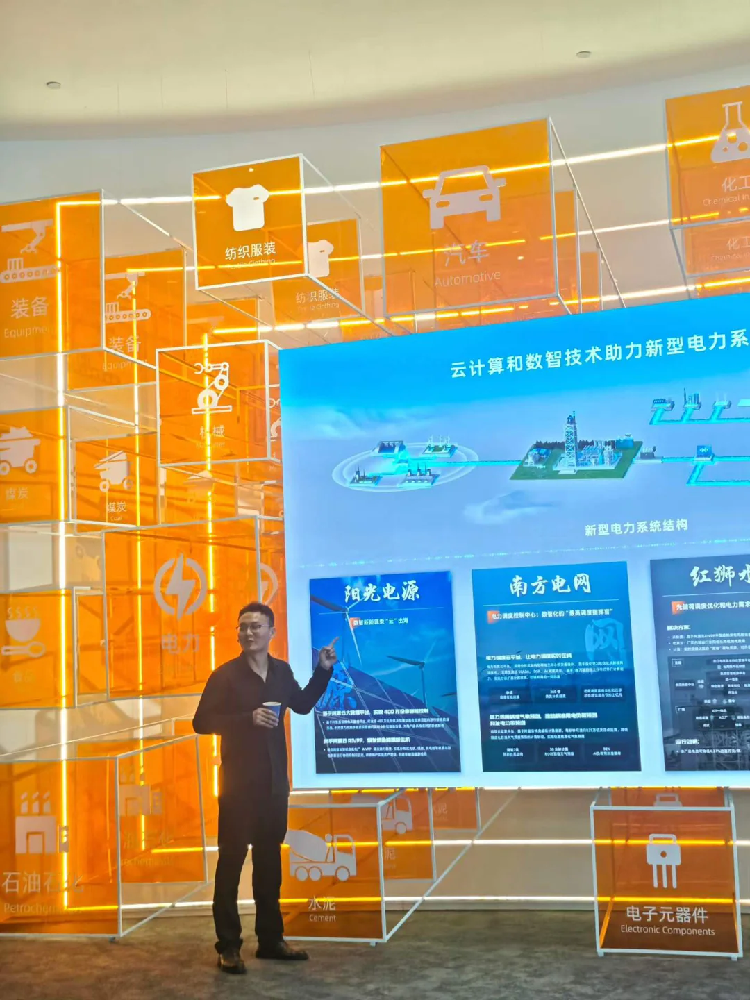

这次参访让我更愿意相信：AI 不应只停留在概念里，也不应只是少数人手里的工具。我希望它能在获得授权、承担责任并经受真实验证之后，进入产业、土地和普通人的生活。

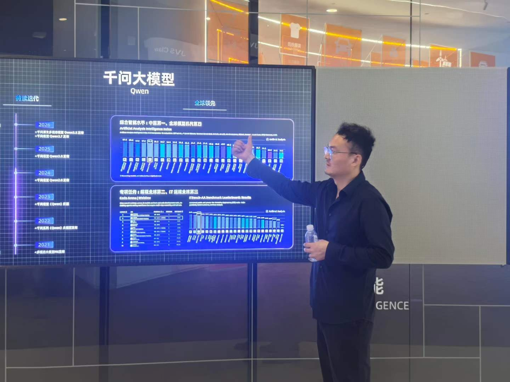

接下来，我希望继续探索 AI 赋能农、林、牧、渔等实体产业的具体路径，支持实体经济发展。尤其是在农村合作社方向，我也计划开办 AI 免费培训，让更多普通老百姓能真正理解 AI、使用 AI，用技术提高生产效率、拓宽经营思路。

为老百姓谋福利，做实事，这不是一句口号。经历过低谷之后，我越来越相信，能把自己重新站起来的能力，变成对别人有用的东西，才是继续往前走最踏实的意义。

## 结语：重来不是凯旋

我不想把 2026 年写成对 2022 年的胜利。一次参访、一个头衔和一个重新开始的方向，不能替过去偿还代价，也不能证明未来已经兑现。它们只说明，我又有力气走到桌前，面对一个问题，并愿意让现实回答它。

重来不是变回那个相信自己可以解决一切的人。它是带着另一种记忆继续生活：知道公司会倒，身体会记账，关系会被选择压伤，家人的沉默不会因为后来成功就自动消失。知道这些以后，仍然愿意做事，但不再把所有人的明天押在自己的确信上。

这篇故事写到这里，没有凯旋，也没有彻底和解。我仍在学习怎样承担、怎样修复，怎样让新的工作不重复旧的伤害。所谓重新出发，也许只是今天比过去更早看见代价，更愿意求助，并在必须停下时，给自己和别人留一条回去的路。
