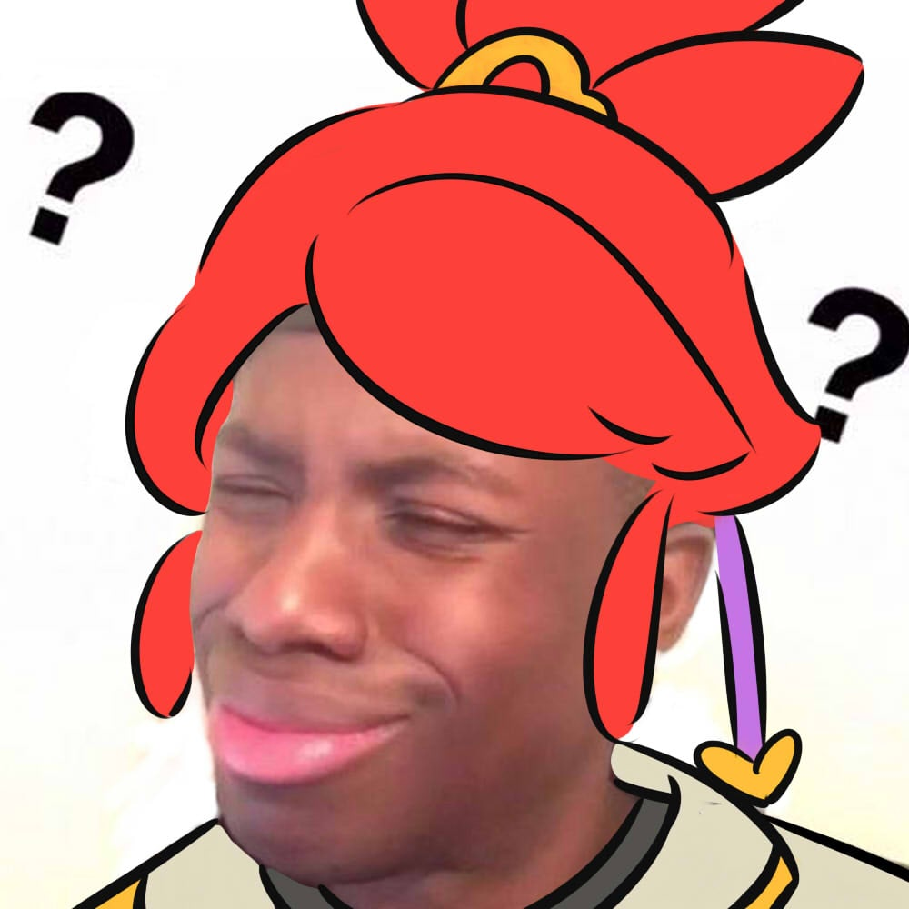

# 杂谈与旧日回声

> 本篇由早期博客文章整理而来，保留了一点当年的玩笑、锋芒和不成熟。它不是全书的主线，更像抽屉里几封没有寄出的信：有些判断已经改变，有些狼狈仍值得记住。
>
> 内容提醒：文中涉及校园暴力、长期失眠和曾经出现过的轻生念头。它们只是个人回忆，不构成医疗建议；如果你正在经历类似的危险，请尽快联系身边可信任的人和当地专业援助。

## 关于培训、职业选择与自学

互联网行业曾经因为高薪和快速增长，成为许多人想要转入的方向，也因此变成最热门、最容易被误解的行业之一。
如果你只是因为它的薪水暂时高于现在的工作，却对日常工作没有兴趣，也没有准备好长期练习，那么当初越急切地进入，后来往往越痛苦地离开。

选择职业时，至少同时考虑两件事：你是否愿意长期靠近它，以及你是否能通过训练把它做得越来越好。没有哪份工作能每天都令人兴奋，但一条完全违背自身兴趣和能力的路，很难靠意志走得长久。

怕伤及国内某些机构的利益，摘一段《前端开发者手册2017》里的话(删掉了点名的机构)：
>Lately a lot of non-accredited, expensive, front-end code schools/bootcamps have emerged.
 These avenues of becoming a front-end developer are typically teacher directed courses, that follow a more traditional style of learning, from an official instructor.
 Keep in mind, if you are considering an expensive training program, this is the web!
 Everything you need to learn is on the web for the taking, costing little to nothing.
 However, if you need someone to tell you how to take and learn what is actually free, and hold you accountable for learning it, you might consider an organized course.
 Otherwise, I am not aware of any other profession that is practically free for the taking with an internet connection, a hundred dollars a month for screencasting memberships, and a burning desire for knowledge.

 --《Front-end Developer Handbook 2017 (Kindle 位置 810-813). GitBook》

 所以对于想要通过培训来进入这个行业的人，我的建议是：

 你想从事的是互联网行业，应该具备利用互联网的意识，把高昂的费用给自己买些好玩的吧。
 >如果你是在校学生，培训单位怂恿你办理类似贷款（分期还款）的业务，请务必要慎重，那些单位真的是有些坏！

## IT 培训靠谱吗？

我花了4个月时间 2万块钱培训了web前端开发

刚培训完两个星期我就收到了美团网的offer

我承认我不是班里学习最好的

但我却是班里第一个找到工作的

而且还是个大厂

我一直相信 勤能补拙 只要有决心 什么事都是可以做到的

今天入职一个星期了

公司的人对我都很好  还给我配了 电动车 和头盔 还有大衣   不说了  来单了

## 每天五分钟，真的能学会英语吗？

“每天几分钟，英语就会突飞猛进”是很诱人的标题，却常常把时间投入和真实结果之间的距离藏起来。五分钟当然有价值：可以复习十个词、跟读一小段材料，或者写下三句英文；但它应该是系统里的一个小齿轮，而不是替代系统本身的魔法。

碎片时间适合启动和复习，不适合承担全部学习。对在职人士来说，更现实的做法是：平日用短时段保持接触，每周留出几次完整时间做精听、阅读、口语或写作，再用一个可见成果检查自己是否真的学会了。

所以，在为课程付费之前，先问清楚它是否提供反馈、练习和可验证的成果，而不是只售卖一个漂亮的分钟数。

---

## Kindle 和 iPad

我知道现在很多人的kindle和iPad在吃灰，甚至是平常被用来当泡面盖子。
这可能是有趣的玩法，不过这真的是我们购买这些电子产品的初衷吗？

## 个人惨痛的学习经历

初中时期，我的成绩稳稳排在年级第一，我得意忘形，目中无人。

初二的时候，新来一个数学老师，我实在无法接受他把那么简单的数学题目讲错，我对他的教学不屑一顾，完全不把他布置的作业放在心上，上课时也自己玩自己的。

直到有一天他又双叒叕讲错了一道题，我忍不住笑了出来，并摇了摇头，他估计是积怨已久，发疯似地打我，对我拳打脚踢，后来校长知道此事将那个老师开除了；

初三，我居然故伎重演，又嘲笑了另一位数学老师，这次不是因为他讲错了，而是他给出的方法不是最优解，我又双叒叕被暴打了一顿，当时我的同桌都被吓哭了，而我似乎没有感觉到太多的疼痛。

那个老师后来找我道歉，他打自己耳光，拉着我的手去锤他，我说"上一个打我的老师被开除了"，
他告诉我说他的父亲病重，他的哥哥游手好闲，他需要这份工作，我和他达成了协议：我不需要再去上他的数学课，我可以出去玩。

后来我的确也没有去上过他的数学课。

在此之后，我对数学完全失去了兴趣，参加奥数比赛获得的奖状也被我狠狠地撕碎了。

年少轻狂。呵。

到了高中，学习压力真的很大，不仅仅来源于外界，也来源于对自己提出的过高要求。

由于我夜间充电时间没把握好，导致白天因为精力不足，上课效果很差，夜间又无法尽快入睡，我又开始担心因为休息时间不够导致白天萎靡不振，于是越焦虑越睡不着。

班主任责备我成绩一落千丈，问我是不是谈恋爱、上网打游戏等，经常喊我去办公室谈话（实际上是批评）；

年级主任也只是关心我是不是早上又迟到了，被他抓住，又立一功；

我爸得知我的成绩落在了多少名之外，便再也不愿意来开家长会；

久而久之，恶性循环，我开始失眠，我对自己非常失望，我的座位被调到了第一排，我的床位也搬进了医院；

此后，我用了长达2年的时间去治疗失眠，那是一段暗无天日的时光；

在这段痛苦的时间内，我多次想要轻生，说失眠痛苦已经是一种仁慈的描述；

无数个清冷的夜里，我一个人跑到卫生间莫名的流下眼泪，不知道人生到底有什么意义；

我希望我可以美美的睡上一觉，可是我怎么也睡不着！

**没人来告诉我，生活的意义并不是与他人争高下，而在于享受努力实现目标的过程，结果是对自己行动的嘉奖。**

在失眠之前，我都是用左手写字的，在失眠期间，为了打发无聊的时间，我学会了用右手写字，我开始练习书法，这一定程度上减轻了我的痛苦。
我把更多的时间投入到练习书法中来，参加书法比赛获奖，语文作文多次在年级考试中获得满分（我记得最清楚的是那篇批评应试教育的）；

我开始体会到了一些不一样的东西，夜里我开始犯困，我睡得着了。

在之后我的成绩也渐渐提高了一些，虽然高考我很失败，靠着语文和英语高分勉强上了一本（到高中后我就基本不再碰数学了）。

所以，当你处于人生低谷时，不妨试试学习新的东西，很可能会从这些事情里找到不一样的乐趣。

**要学会放弃，学会接受自己，学会找到自己真正喜欢的事情。如果某件事情是你工作和生活所依赖的，那么试着去喜欢她吧。**

这也是我分享自己学习经验的初衷，我希望大家能少走弯路，重新认识一些事情。

---

大学期间，英语老师跟我杠上了，主要的原因是某节课我没有带课本，她提我拼写，而我居然全写对了。

她用英语表扬了我，我也用英语装了一回x，基本流利地与她完成了一次口语对话。

那节课上，全年级的人都向我投来羡慕（其实是鄙夷）的目光，现在回想起来都还有些得意呢。

**之后，她盯上了我，我没有一次是能成功躲过她的点名！**

位列年级四大逃课之首的我，别提多恨她了。

后来，**在英语老师的努力下，我们系所有的老师都盯上了我**，每次点名都先问2班的xxx来了没有，如果我来了，那么这节课就不用再点名了。

于是，到大三下学期，我挂了19门课。

大四开学，学校要求将我降级退到大三，眼看毕业无望。

结果英语老师帮我找班主任、系主任、教务处，坚持让我留在原年级学习，也就是一次重修19门课不过的话就直接肄业，神tm的中国好老师。

大四，我背着沉沉的书包，每天去教室和图书馆自习。每个回宿舍的傍晚，我都要狠狠地恨一遍我的英语老师。

怎么会有这样丧心病狂的老师呢？

期末考试，共26门课，我身心俱疲，叫苦不迭。

在得知重修的19门课全过了之后，我开心的眼泪都快掉下来。终于可以狠狠地把脸打回去了，你丫的不就是想看我毕不了业的笑话么！

然后我在给自己的毕业寄语上写下一句话：“大学期间，千万别跟自己的老师谈恋爱！”

## 总结

写了这么多，我更愿意这样总结：天赋可能影响起点，长期的练习、反馈和兴趣决定你能走多远。

努力不是万能的，但它是最可靠的起点；更重要的是，把努力放在正确的方向上。

> 关于被老师暴打，更多的问题在我：那时的我自以为是，没有顾及老师的尊严，也没有学会用更好的方式表达不同意见。

这篇文章有夸张、有玩笑，也有当时真实的疼痛。愿它被当作旧日回声读过，然后留在过去。

下一篇：[后记：进阶不是离开原来的自己](../part-6/afterword.md)
